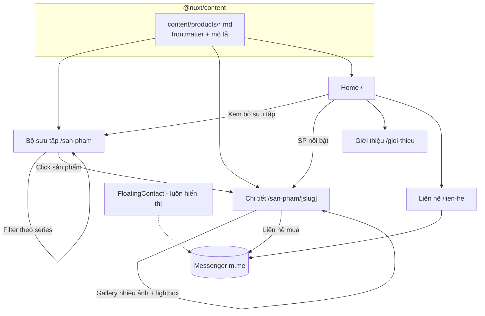

# Thiết kế: Website showcase đồ chơi in 3D chủ đề Tokusatsu

- **Ngày**: 2026-06-28
- **Trạng thái**: Đã duyệt hướng thiết kế, chờ review spec
- **Loại**: Greenfield (project mới hoàn toàn)

## 1. Mục tiêu & phạm vi

Xây website **showcase** (KHÔNG bán hàng trực tuyến) cho một shop bán đồ chơi/figure
in 3D chủ đề Tokusatsu (Kamen Rider, Ultraman, Super Sentai, Godzilla/Kaiju...).

Mục tiêu chính:
- Trưng bày sản phẩm đẹp, chuyên nghiệp, để khách xem được **chi tiết** model 3D.
- Mỗi sản phẩm có **nhiều ảnh** (gallery + lightbox zoom).
- Khách quan tâm thì bấm nút **liên hệ qua Messenger** để hỏi mua.

Ngoài phạm vi (YAGNI - sẽ KHÔNG làm):
- Giỏ hàng, thanh toán, tài khoản, quản lý đơn.
- Backend/CSDL động, admin panel.
- Đa ngôn ngữ (chỉ tiếng Việt).
- Tìm kiếm full-text, đánh giá/bình luận.

## 2. Quyết định đã chốt

| Hạng mục | Quyết định | Lý do |
|---|---|---|
| Framework | Nuxt 3, render **SSG** (`nuxt generate`) | Host tĩnh miễn phí, SEO tốt, nhanh |
| Dữ liệu sản phẩm | **@nuxt/content** (Markdown + frontmatter) | Git-versioned, không cần backend, dễ sửa |
| Styling | **Tailwind CSS** | Kiểm soát design system, dev nhanh |
| Tối ưu ảnh | **@nuxt/image** | Site nặng ảnh, cần lazyload + responsive |
| Ngôn ngữ nội dung | Tiếng Việt | Khách hàng người Việt |
| Thẩm mỹ | **Museum / Gallery** (sạch, sang, tối giản) | Sản phẩm là nhân vật chính |
| Assets | Placeholder trước (`picsum.photos/seed/...`) | Chưa có ảnh thật, thay sau |
| Liên hệ | Nút **Messenger** (`m.me/<page>`) | Không có flow mua hàng |

## 3. Kiến trúc tổng thể



## 4. Cấu trúc thư mục

```
content/
  products/
    <slug>.md              # 1 file / sản phẩm (frontmatter + mô tả markdown)
public/
  products/<slug>/         # ảnh thật của SP (sau này); tạm dùng picsum
pages/
  index.vue                # Home
  san-pham/index.vue       # Grid + filter theo series
  san-pham/[slug].vue      # Chi tiết + gallery + lightbox
  gioi-thieu.vue           # About
  lien-he.vue              # Contact
layouts/
  default.vue              # Header + Footer + FloatingContact
components/
  AppHeader.vue
  AppFooter.vue
  ProductCard.vue          # thẻ SP trong grid
  ProductGallery.vue       # ảnh lớn + thumbnail strip
  Lightbox.vue             # overlay zoom ảnh
  SeriesFilter.vue         # lọc theo series
  MessengerButton.vue      # nút CTA tái dùng (link m.me)
  FloatingContact.vue      # nút nổi góc phải-dưới
  SectionHeading.vue       # tiêu đề section nhất quán
composables/
  useProducts.ts           # query @nuxt/content, lấy series, featured
  useSiteConfig.ts         # đọc config trung tâm (link Messenger, tên shop...)
content/
  config.ts                # định nghĩa collection schema (Nuxt Content v3)
app.config.ts              # cấu hình site: tên shop, m.me link, mô tả
nuxt.config.ts
tailwind.config.ts
```

## 5. Model dữ liệu sản phẩm

Mỗi sản phẩm là 1 file `content/products/<slug>.md`:

```yaml
---
title: "Kamen Rider Kuuga - Mighty Form"
slug: "kamen-rider-kuuga-mighty"      # = tên file, dùng cho route
series: "Kamen Rider"                  # dùng cho filter
scale: "1/12"                          # tỉ lệ
height: "18 cm"                        # chiều cao
material: "Resin in 3D + sơn thủ công"
priceRef: "Liên hệ"                    # giá tham khảo dạng text (không bán online)
featured: true                         # hiện ở Home
order: 1                               # thứ tự ưu tiên
images:
  - "https://picsum.photos/seed/kuuga-1/1200/1500"
  - "https://picsum.photos/seed/kuuga-2/1200/1500"
  - "https://picsum.photos/seed/kuuga-3/1200/1500"
cover: "https://picsum.photos/seed/kuuga-1/1200/1500"  # ảnh đại diện grid
---

Mô tả chi tiết sản phẩm dạng markdown: câu chuyện nhân vật,
chi tiết model, tùy chọn màu sơn, lưu ý đặt hàng...
```

**Series** (giá trị cho filter, có thể mở rộng): `Kamen Rider`, `Ultraman`,
`Super Sentai`, `Kaiju / Godzilla`, `Khác`.

`useProducts` cung cấp:
- `getAllProducts()` - sắp xếp theo `order`.
- `getFeatured()` - lọc `featured === true`.
- `getProductBySlug(slug)`.
- `getSeriesList()` - danh sách series duy nhất (để render filter).
- `filterBySeries(series)`.

## 6. Đặc tả từng trang

### 6.1 Home (`/`)
- **Hero**: tên shop + 1 câu định vị ngắn (<= 20 từ, <= 2 dòng), 1 ảnh model lớn
  chất lượng cao bên cạnh (asymmetric split, không center mặc định). 1 CTA chính
  "Xem bộ sưu tập" + tối đa 1 phụ. Gọn trong viewport, `pt` <= 6rem.
- **Sản phẩm nổi bật**: grid 3-4 SP `featured`, layout có nhịp (không 3 card đều
  cứng nhắc - dùng grid bất đối xứng có chủ đích).
- **Giới thiệu ngắn về shop / quy trình in 3D**: 1 section text + 1 ảnh, dẫn sang About.
- **CTA liên hệ** cuối trang (Messenger).

### 6.2 Bộ sưu tập (`/san-pham`)
- Tiêu đề + mô tả ngắn.
- **SeriesFilter**: dải chip lọc theo series (client-side, không reload). Mặc định "Tất cả".
- **Grid sản phẩm**: `ProductCard` (cover + tên + series + tỉ lệ). Hover tinh tế
  (scale nhẹ ảnh / hiện overlay tên). Responsive: 1 cột mobile -> 2 -> 3.
- Empty state nếu series không có SP.

### 6.3 Chi tiết (`/san-pham/[slug]`)
- **ProductGallery**: ảnh lớn + dải thumbnail dưới/bên. Click thumbnail đổi ảnh chính.
  Click ảnh chính mở **Lightbox** (overlay full màn, zoom, điều hướng prev/next, đóng
  bằng ESC / click nền / nút X). Hỗ trợ phím mũi tên, focus trap, `prefers-reduced-motion`.
- **Thông tin**: tên, series, tỉ lệ, chiều cao, chất liệu, giá tham khảo (text).
- **Mô tả** (render markdown body).
- **MessengerButton** nổi bật: "Liên hệ đặt mua qua Messenger" (kèm tên SP trong nội dung mặc định nếu m.me hỗ trợ, nếu không thì link thẳng).
- Gợi ý SP cùng series (tối đa 3-4) ở cuối.
- Route được sinh tĩnh từ danh sách products khi `nuxt generate`.

### 6.4 Giới thiệu (`/gioi-thieu`)
- Câu chuyện shop, đam mê tokusatsu, quy trình in 3D + sơn thủ công (mục tăng tin cậy).
- 2-3 ảnh thật (placeholder), layout editorial, không lặp layout với Home.

### 6.5 Liên hệ (`/lien-he`)
- Thông tin liên hệ: Messenger (chính), có thể kèm Facebook page / khu vực / giờ phản hồi.
- **KHÔNG có form** (không backend). Chỉ các kênh liên hệ + nút Messenger lớn.
- Có thể nhúng bản đồ tĩnh / khu vực nếu cần (tùy, không bắt buộc).

## 7. Hướng thiết kế (Museum/Gallery, chống AI-slop)

Áp dụng skill `design-taste-frontend`. Dials phù hợp brief museum tối giản:
`DESIGN_VARIANCE 6 / MOTION_INTENSITY 4 / VISUAL_DENSITY 3`.

- **Bảng màu**: nền off-white trung tính (KHÔNG dùng họ beige+brass+espresso bị cấm),
  chữ off-black (không `#000`), **1 accent duy nhất** dùng cực tiết chế. Có dark mode.
- **Typography**: sans display có gu cho heading (vd Geist / Cabinet Grotesk / PP Neue
  Montreal), sans sạch cho body. **Không serif mặc định**, không Fraunces/Instrument Serif.
  Nhấn mạnh bằng italic/bold cùng font, không trộn family.
- **Layout**: nhiều whitespace (`py` lớn), grid bất đối xứng có nhịp, >= 4 layout family
  khác nhau trên Home. Không center hero mặc định.
- **Ảnh**: là nhân vật chính, dùng `@nuxt/image` + `picsum.photos/seed/...` cho placeholder,
  để slot rõ ràng cho ảnh thật. Không fake screenshot bằng div, không SVG vẽ tay.
- **Motion**: micro-interaction tinh tế (fade/translate khi vào viewport, hover ảnh).
  Honor `prefers-reduced-motion`. Không animation thừa, không marquee.
- **Cấm (AI tells)**: em-dash ở mọi nơi; eyebrow rải khắp (tối đa 1/3 section); scroll cue;
  locale/time/weather strip; version label; decorative dots; gradient tím/glow.

## 8. Cấu hình trung tâm

`app.config.ts` chứa các giá trị shop dễ đổi:
```ts
export default defineAppConfig({
  shop: {
    name: "<Tên shop>",
    tagline: "<câu định vị>",
    messengerUrl: "https://m.me/<page-username>",   // placeholder, thay sau
    facebookUrl: "https://facebook.com/<page>",
    responseTime: "Thường phản hồi trong vài giờ",
    area: "<Khu vực / Tỉnh thành>",
  },
});
```
`MessengerButton` và `FloatingContact` đọc `messengerUrl` từ đây -> đổi 1 chỗ, áp toàn site.

## 9. SEO & chất lượng

- `useSeoMeta` mỗi trang (title, description, OG image = cover SP / ảnh hero).
- Sitemap (tùy chọn, `@nuxtjs/sitemap`) - có thể thêm sau, không bắt buộc cho v1.
- Accessibility: alt cho mọi ảnh (lấy từ title), focus state rõ, lightbox có focus trap +
  bàn phím, contrast WCAG AA, nút có nhãn rõ.
- Performance: ảnh hero `priority`, lazyload phần dưới, CLS thấp (reserve khung ảnh),
  font self-host `font-display: swap`.

## 10. Tiêu chí hoàn thành (Definition of Done)

- [ ] `npm run dev` chạy, 5 trang điều hướng được.
- [ ] Thêm/sửa SP chỉ bằng cách thêm/sửa file `content/products/<slug>.md`.
- [ ] Grid filter theo series hoạt động (client-side, không reload).
- [ ] Trang chi tiết: gallery đổi ảnh + lightbox zoom + phím tắt + reduced-motion.
- [ ] Nút Messenger ở: floating, trang chi tiết, trang liên hệ - đều trỏ `messengerUrl`.
- [ ] `nuxt generate` ra site tĩnh, mọi route SP được prerender.
- [ ] Dark mode hoạt động, không section nào lệch theme.
- [ ] Pre-flight check của design-taste-frontend pass (không AI tells, không em-dash).
- [ ] Responsive mobile/tablet/desktop.
```
